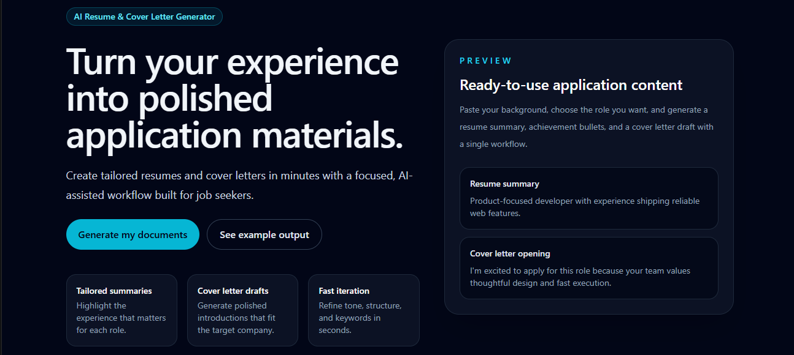
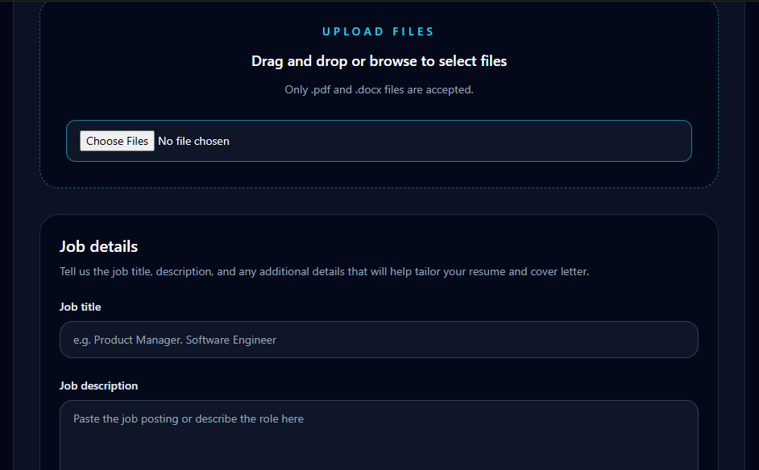
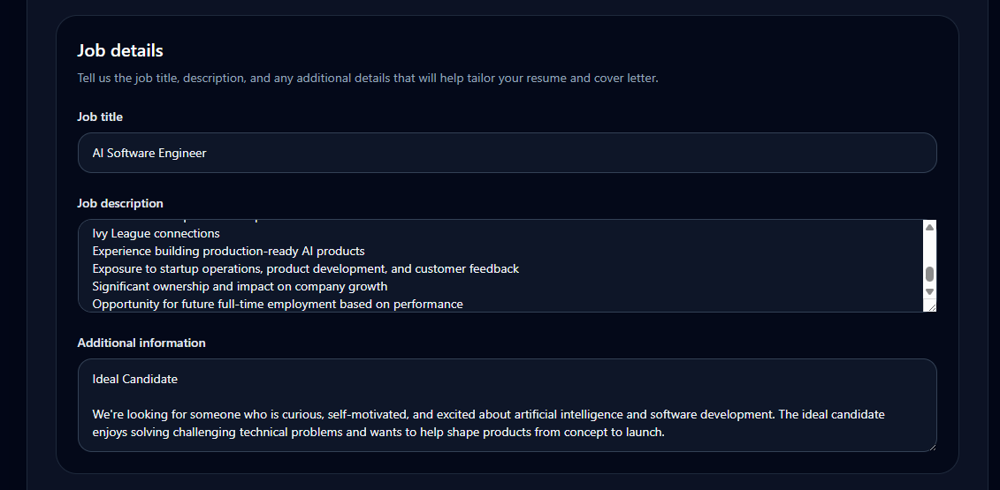
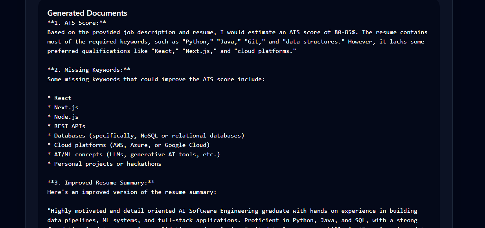
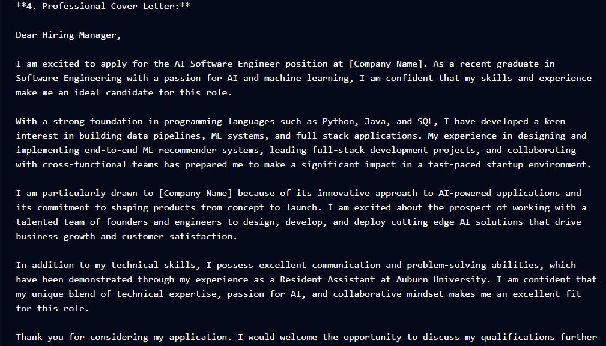

# AI Resume & Cover Letter Generator

An AI-powered web application that helps job seekers create tailored resumes and cover letters based on specific job descriptions. The application leverages large language models to generate professional, customized content that aligns with a user's skills and career goals.

Live Demo: https://github.com/user-attachments/assets/acbb81f0-579b-433a-9255-c500b8b01b93

## Features

* Generate personalized cover letters
* Create tailored resume content
* Input job descriptions and application details
* AI-powered content generation using Groq's Llama model
* Responsive and user-friendly interface

## How It Works

React frontend collects a user's job description and background details, then sends them to an Express backend. The backend constructs a prompt and calls Groq's Llama model to generate tailored resume and cover letter content, which is returned to the frontend for review.
1. Enter job information and requirements.
2. Provide relevant experience and background details.
3. Submit the form.
4. The AI generates customized application materials.
5. Review and refine the generated content before submitting applications.

## Screenshots

### Home Page


### Resume Upload



### Job Description



### Generated Documents 1



### Generated Documents 2




## Tech Stack

### Frontend

* React
* TypeScript
* React Router
* Tailwind CSS

### Backend

* Node.js
* Express.js
* Groq API (Llama Model)

## Installation

```bash
# Clone the repository
git clone https://github.com/wilcoxjoseph/ai-resume-cover-letter-generator.git
cd ai-resume-cover-letter-generator

# Install frontend dependencies
npm install

# Install backend dependencies
cd server
npm install
```

### Enviroment Setup
Create a .env file inside the server directory:
GROQ_API_KEY =your_api_key_here
PORT=5000

### Running the App
```bash
# Started backend (from /server)
node index.js

# Start frontend (from project root, in a seperate terminal
npm run dev
```
The frontend runs at http://localhost:5173 (or your configured Vite port) and communicates with the backend at http://localhost:5000.

## Future Improvements

* User authentication
* Document storage and management
* Application history tracking
* Resume optimization suggestions

## Motivation

As a recent Software Engineering graduate, I wanted to build a practical AI application that helps streamline the job application process while demonstrating full-stack development and AI integration skills.

## Author

Joseph Wilcox
